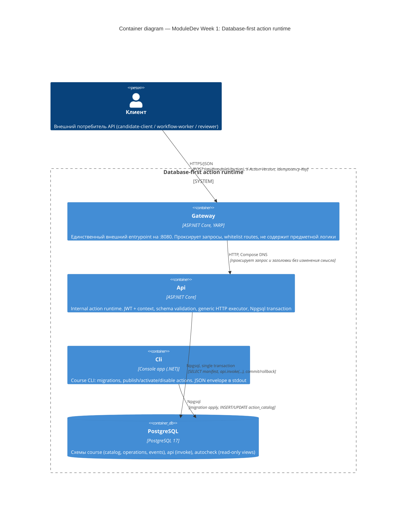

# C4 Container diagram

Database-first action runtime — контейнерная диаграмма (уровень C4 Container).

## Пояснения к связям

| Связь | Что проверяется/гарантируется |
|---|---|
| Client → Gateway | единственная публичная точка входа (`:8080`); JWT/credentials/payload не логируются |
| Gateway → Api | Compose DNS (`http://api:8080`), не `localhost`; gateway не видит catalog и PostgreSQL |
| Api → PostgreSQL | одна Npgsql transaction на HTTP-запрос; `api.invoke` — единственная точка предметного выполнения; runtime-роль без прямого DML к предметным таблицам |
| Cli → PostgreSQL | публикует/активирует actions и применяет миграции; использует отдельную (publication) роль, не runtime-роль `api` |

Если нужен PNG/SVG — этот mermaid-блок рендерится в GitHub/GitLab автоматически, либо экспортируется через `mmdc` (mermaid-cli) или https://mermaid.live.
